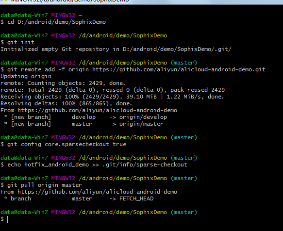

# 广东工业大学计算机学院课程攻略

给作者加鸡腿🍖：

<table>
<tr>
    <td>
        
    </td>
    <td>
    
    </td>
</tr>
</table>

## 目录
- [使用指南](#使用指南)
- [资源分类](#资源分类)
- [推荐阅读](#推荐阅读)
- [了解工大更多](#了解工大更多)
- [相关说明](#相关说明)
- [支持开源](#支持开源)

## 使用指南
**内容的查找搜索**：
- 使用浏览器进入仓库首页之后，按下快捷键`t`，进入文件搜索模式，输入你想要寻找的文件名或者文件夹名，即可实时展示搜索结果。
- 安装[Octotree](https://addons.mozilla.org/zh-CN/firefox/addon/octotree/)或者[GiteeTree](https://addons.mozilla.org/zh-CN/firefox/addon/giteetree/)浏览器扩展插件，方便在网页上浏览项目的文件夹和文件

**文件的下载**：
- [Online（国内访问和下载较快）](https://brenner8023.gitee.io/gdut-course/)
- [GitHub项目托管（内容最新）](https://github.com/brenner8023/gdut-course)
- [码云项目托管（国内访问和下载较快）](https://gitee.com/brenner8023/gdut-course)
- 使用`git clone https://gitee.com/brenner8023/gdut-course.git --depth 1`
- 下载单文件夹的方法，参考[相关说明](#%E7%9B%B8%E5%85%B3%E8%AF%B4%E6%98%8E)

## 资源分类
- [大一](./public/大一/)
- [大二](./public/大二/)
- [大三](./public/大三/)
- [毕业设计](./public/毕业设计/)
- [校园招聘](./public/校园招聘/)
- [其它](./public/其它/)

## 推荐阅读
项目自荐/分享请发起issue或者提交PR😘

- [宇工大联网拨号器](https://github.com/GDUT-Drcom/GDUT-Drcom-Dialer)
- [A&D工作室](https://github.com/AttackandDefenceSecurityLab)
- [腾讯师兄的程序员之路](./public/其它/腾讯师兄的程序员之路/README.md)

相关链接：
- [浙江大学课程攻略共享计划](https://github.com/QSCTech/zju-icicles)
- [清华大学计算机系课程攻略](https://github.com/PKUanonym/REKCARC-TSC-UHT)
- [北京大学课程资料整理](https://github.com/lib-pku/libpku)
- [南京大学课程复习资料](https://github.com/idealclover/NJU-Review-Materials)
- [中国科学技术大学课程资源](https://github.com/USTC-Resource/USTC-Course)
- [上海交通大学课程资料分享](https://github.com/CoolPhilChen/SJTU-Courses/)
- [东南大学课程共享计划](https://github.com/zjdx1998/seucourseshare)
- [北京林业大学信息学院课程攻略](https://github.com/bljx/BFU-leaf)
- [山东科技大学课程资源共享计划](https://github.com/deepwzh/sdust-examination-materials)
- [华南师范大学 - 0xFFFF CS Wiki](https://www.yuque.com/0xffff.one/cs-learning)

## 了解工大更多
- 👨‍🎓 [知乎-广东工业大学话题](https://www.zhihu.com/topic/19604314)
- 🍻 [哔哩哔哩-广东工业大学](https://search.bilibili.com/all?keyword=%E5%B9%BF%E4%B8%9C%E5%B7%A5%E4%B8%9A%E5%A4%A7%E5%AD%A6)
- 🤖 [百度贴吧-广东工业大学吧](https://tieba.baidu.com/f?kw=%E5%B9%BF%E4%B8%9C%E5%B7%A5%E4%B8%9A%E5%A4%A7%E5%AD%A6)
- 🏠 [广东工业大学新闻网](http://gdutnews.gdut.edu.cn/)

## 相关说明
1. 实验课和课设是放在对应课程的文件夹中的。
2. 目前(2019年)计算机学院共有四个专业: 软件工程, 计算机科学与技术, 网络工程, 信息安全. 不同专业会有不同的专业课, 也没有作出详细区分🙄。
3. 学校将一些课程(比如大学物理)分为上和下两门课程, 并安排在不同的学期上课, 而我将其归类在了同一个文件夹中, 未作详细区分😅。
4. watch、star、fork的说明：
    - star 的作用是收藏，目的是方便以后查找。
    - watch 的作用是关注，目的是等我更新的时候，你可以收到通知。
    - fork 的作用是参与，目的是你增加新的内容，然后`Pull Request`，我会考虑把你的修改和我原来的内容合并。
5. GitHub默认只支持下载完整项目或者单个文件，不支持下载单个文件夹，可以使用`sparse checkout`只下载单个文件夹，[教程在此](https://www.jianshu.com/p/74a0441ed9b7) 👈 使用截图如下：

## 支持开源
- 本项目被刊登在阮一峰老师的科技爱好者周刊[第55期](http://www.ruanyifeng.com/blog/2019/05/weekly-issue-55.html)。

## 联系我
1. 使用[issue](https://github.com/brenner8023/gdut-course/issues)反馈建议，提交问题
2. 可以通过提交PR一起维护本项目，
3. 作者的邮箱（base64加密）：`dnVlNjY2QHFxLmNvbQ==`（注明来自gdut-course）。
